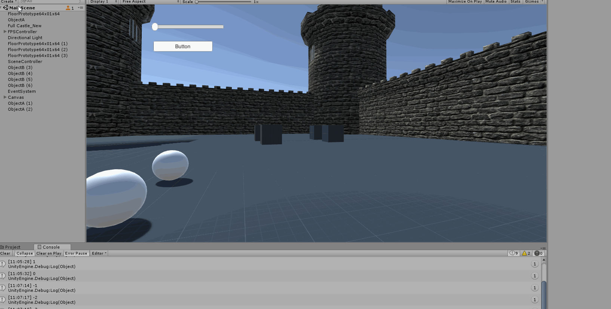

# InterfacesInteligentesP3

Para esta práctica se nos pedía incoporar a nuestra escena un conjunto de eventos que controlaran el comportamiento de dos objetos cuando el usuario chocase con ellos. 
Para ello tenemos dos tipos de objetos: 
1. Los objetos de tipo A: Representados por esferas, **las cuales aumentaran el poder el personaje** al chocar con ellas. 
2. Los objtos de tipo B: Representados por cubos, **los cuales aumentaran de tamaño y reducirán el poder** al chocar con ellos. 

## Conjunto de Scripts. 
Para esta parte lo que hemos hecho es crear un GameController, el cual se encargará de controlar y lanzar los eventos. Este se representa en la escena con un GameObject vacío. En él tenemos 3 eventos de aumentar poder, disminuir poder, y cambiar la luz que se activa con la tecla L. 
Por consiguiente en cada script de los ObjectA y ObjectB lo que tenemos es la acción que tienen que realizar al notar el impacto y no podemos olvidar que estos deben estar subscritos a la lista de eventos para que puedan desencadenarse. 
Finalmente mostramos una serie de GIF con la ejecución de los mismos. 

